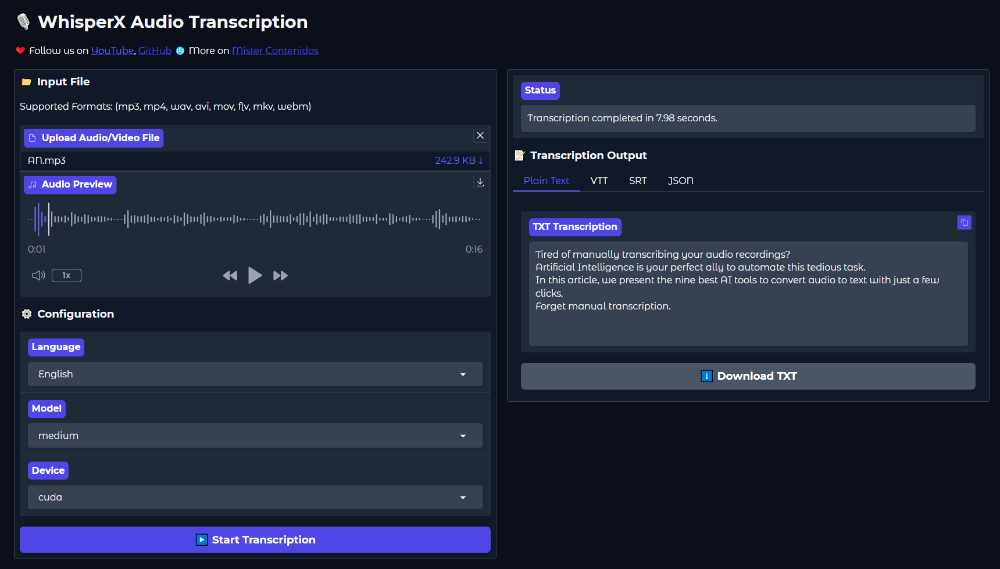

# **WhisperX Backend mit deutscher Benutzeroberfläche**

## **Beschreibung**
Dieses Projekt ist eine erweiterte WhisperX-Installation mit deutscher Gradio-Benutzeroberfläche, optimiert für lokale Audio- und Videotranskription. Es basiert auf [WhisperX](https://github.com/m-bain/whisperX) und [Faster Whisper](https://github.com/SYSTRAN/faster-whisper) und bietet erweiterte Funktionen für Systemverwaltung, Authentifizierung und Leistungsoptimierung.
### **Hauptmerkmale**
- 🇩🇪 **Deutsche Benutzeroberfläche**: Vollständig lokalisierte Gradio-Oberfläche
- 🔐 **Authentifizierung**: Optionale Anmeldung via Benutzername/Passwort
- ⚡ **Speed Mode & Präzisions-Modus**: Wählbare Transkriptionsmodi
- 🛠️ **Systemverwaltung**: VRAM-Bereinigung, Prozessverwaltung, Auto-Restart
- 🎯 **Multi-Modell-Support**: Unterstützung für large-v3, large-v2, und spezialisierte deutsche Modelle
- 💻 **GPU & CPU Support**: Läuft mit CUDA oder auf CPU
---
## **Systemanforderungen**
- Python 3.10
- CUDA 12.1+ (nur für NVIDIA GPU)
- Windows (primär getestet) oder Linux
---
## **Dateiübersicht**
### **Hauptdateien**
- **`app.py`**: Hauptanwendung mit Gradio-UI (deutsche Sprache)
- **`src/transcriber.py`**: Transkriptions-Engine mit Speed/Präzisions-Modi
- **`src/model_manager.py`**: Modellverwaltung und -caching
- **`src/utils.py`**: Hilfsfunktionen für Dateivalidierung und Konvertierung
### **Setup-Dateien**
- **`setup_environment_cuda.bat`**: Installationsskript für Windows mit NVIDIA GPU (CUDA 12.1+)
- **`setup_environment_cpu.bat`**: Installationsskript für Windows ohne NVIDIA GPU
- **`run_script.bat`**: Startet die Anwendung nach der Installation
- **`start_whisperx.ps1`**: PowerShell Auto-Restart-Script mit Health-Check
### **Konfigurationsdateien**
- **`environment-cuda.yml`**: Conda-Umgebung für GPU-Systeme
- **`environment-cpu.yml`**: Conda-Umgebung für CPU-Systeme
- **`requirements/requirements_cuda.txt`**: Python-Dependencies für CUDA
- **`requirements/requirements_cpu.txt`**: Python-Dependencies für CPU
- **`.env`**: Umgebungsvariablen für Authentifizierung (nicht im Repository)
---
